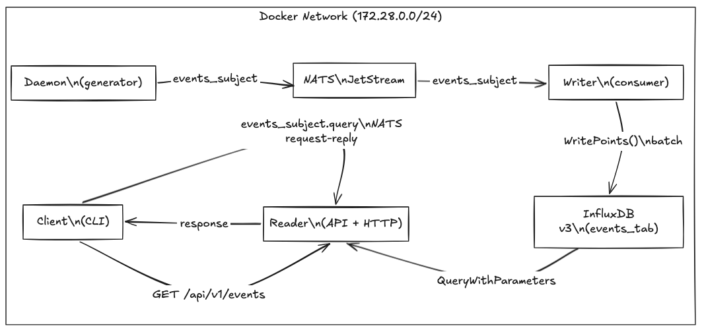

# Real-Time Security Event Pipeline

A production-ready microservices platform for ingesting, storing, and querying security events in real time. Built with **Go 1.26**, **NATS JetStream**, **InfluxDB 3 Core**, and **Docker Compose**.


The platform contains a complete, containerised microservices system implementing a real-time event pipeline that:
 - Continuously generates and ingests security events
 - Persists events into a time-series database
 - Exposes query capabilities via: NATS request-reply and REST API
 - Enforces zero-trust communication
 - Aligns with OWASP ASVS, CIS Docker Benchmark, and secure containerisation best practices


---

## Architecture



### Data Flow

| Step | From | Transport | To | Description |
|------|------|-----------|-----|-------------|
| 1 | **Daemon** | NATS JetStream `js.Publish` | `STREAM_EVENTS` | Publishes `SecurityEvent{criticality, timestamp, eventMessage}` at configurable rate; 3 retries on failure |
| 2 | **NATS** | JetStream push consumer | **Writer** | At-least-once delivery; durable consumer `writer-consumer` survives restarts |
| 3 | **Writer** | Arrow Flight | **InfluxDB** | Batch write ≤ 100 pts per call, flushed every 500 ms, 3 retry attempts with backoff |
| 4 | **Client** | NATS request-reply | **Reader** | Parameterised query; response rendered as a heat-map in the terminal |
| 5 | **HTTP client** | `GET /api/v1/events` | **Reader** | Same query path, REST transport |


The solution is designed with clean Hexagonal Architecture (Ports & Adapters) and containerised deployment using Docker.

**Hexagonal Architecture** was chosen to enforce a strict separation between business logic and infrastructure. The domain layer defines what the system does; adapters define how it communicates with the outside world.

This separation provides three practical benefits for an event pipeline:

  - Swappable infrastructure. NATS, InfluxDB, and Gin are implementation details. Replacing any of them requires only a new adapter — the domain and use case layers are untouched.

  - Testable core. Business rules can be tested without spinning up any external services. Adapters are replaced with lightweight mocks that implement the same port interfaces.

  - Enforced validation boundary. All input validation happens inside the use case layer, not inside a specific transport handler. Any future inbound adapter — HTTP, gRPC, CLI — inherits the same rules automatically.

---

## Quick Start

#### 1. Install dev tools

```bash
make setup
```

Installs `govulncheck`, `gosec`, and `golangci-lint` (requires Go and Homebrew on macOS).

#### 2. Clone

```bash
git clone https://github.com/AlxPolt/security-event-pipeline.git
cd security-event-pipeline
```

#### 3. Generate TLS certificates

```bash
make certs
```

Creates a private CA, issues server + client certificates under `deployments/certs/`. The script is idempotent, re-running replaces existing certs safely.

#### 4. Configure environment

Review `deployments/.env` and adjust values for your environment.

#### 5. Build and start the full stack

```bash
make up
```

Services start in dependency order: `nats` → `influxdb` → `daemon` + `writer` + `reader` → `client`.

#### 6. Verify the pipeline

```bash
# All containers healthy
docker compose -f deployments/docker-compose.yaml ps

# Events flowing into InfluxDB (wait ~5 s for first write)
curl "http://localhost:8080/api/v1/events?criticality=1&limit=5"

# Swagger UI
open http://localhost:8080/swagger/index.html

```

#### 7. Rebuild a single service after code changes

```bash
docker compose -f deployments/docker-compose.yaml up --build -d writer
```

#### 8. Tear down

```bash
make down        # stops all containers and removes volumes
```

---


## Microservices — Design & Patterns

### 1. Daemon

Continuously generates events and publishes them to NATS JetStream.


##### Generator Pattern + Clock Injection

This allows unit tests to freeze or control time without mocking global state (best practice for deterministic testing).

##### Token Bucket Rate Limiter

Prevents the daemon from overwhelming downstream services (NATS, Writer, InfluxDB) during development or misconfiguration. The burst capacity absorbs short spikes without dropping events.

##### Publisher with Retry and Delivery Confirmation

`js.Publish` returns only after NATS confirms the message was persisted to JetStream (unlike `nc.Publish` which is fire-and-forget). The retry loop handles transient network glitches without losing events.

##### Stream Auto-Provisioning

On first startup, the publisher checks whether the JetStream stream exists and creates it if absent.

##### Graceful Shutdown

`signal.NotifyContext` propagates `SIGTERM`/`SIGINT` through the rate limiter's `Wait` call and the publish context, so no goroutines are leaked on container stop.

#### Event Schema

```json
{
  "criticality": 7,
  "timestamp": "2026-02-21T21:14:30.638423Z",
  "eventMessage": "Suspicious connection blocked"
}
```

**Event messages pool (examples):**
- `"Failed authentication"`
- `"Suspicious connection blocked"`
- `"Unexpected process"`


---

### 2. Writer

Consumes security events from NATS JetStream, validates them through the domain layer, and persists them to InfluxDB v3 in batches. Guarantees at-least-once durability: a message is ACKed only after its data is confirmed written to InfluxDB.


The domain `EventProcessor` knows nothing about NATS or InfluxDB — it depends only on interfaces. This allows swapping the message broker or storage engine without touching business logic.

##### Bounded Worker Pool (Semaphore Pattern)

Prevents unbounded goroutine spawning under burst load. `NakWithDelay` avoids immediate redelivery storms — JetStream waits 2 s before retrying.

##### Batch Processing + Flush Worker Pool

InfluxDB v3 performs the same round-trip for N points as for 1 — batching multiplies write throughput by ~N at no extra latency cost.

##### Synchronous ACK Semantics (Result Channel)

The NATS ACK/NAK decision happens *after* InfluxDB confirms the write. Fire-and-forget ACK would risk acknowledging messages that were never persisted.

##### Exponential Backoff Retry

```
Attempt 1: immediate
Attempt 2: wait 1 s
Attempt 3: wait 2 s
─────────────────────
Max extra wait: 3 s per batch before permanent failure
```
Transient InfluxDB unavailability (restart, OOM-kill, network blip) is handled transparently — the batch retries without propagating errors to NATS. Only persistent failures (InfluxDB down for >3 s) result in a NAK and JetStream redelivery.

If the service shuts down during a retry sleep, the sleep is cancelled immediately so graceful shutdown is never blocked.

##### Dead-Letter Strategy

When a batch exhausts all retry attempts, `logDeadLetter` emits a structured log entry for each affected event.

Operators should:
1. Alert on `dead_letter=true` log lines
2. Replay from the NATS stream, which retains messages per its retention policy

JetStream's `MaxDeliver` setting forms the outer retry boundary — after N total NAKs across all retry cycles, JetStream stops redelivering.

##### Domain Validation Pipeline

Every event passes through validation before any infrastructure interaction:

```
Raw NATS bytes
      │
      ▼
json.Unmarshal          ← malformed JSON → msg.Nak()
      │
      ▼
event.Sanitize()        ← trim whitespace, collapse spaces, clamp criticality
      │
      ▼
event.Validate()        ← criticality ∈ [1,10] · RFC3339Nano timestamp
      │                    message non-empty · length ≤ 1000
      ▼
repository.Save()       ← parameterised WritePoints (no string interpolation)
```

Domain validation in the domain layer, not in the adapter, ensures the rule applies regardless of the transport (NATS, HTTP, gRPC, CLI).

##### Graceful Shutdown Sequence

No data is lost or left in an ambiguous ACK state during container stop or rolling restart.

#### Write Pool — Load Limits

| Parameter | Default | Effect |
|-----------|---------|--------|
| `workerCount` | 4 workers | Parallel InfluxDB connections |
| `batchSize` | 100 points | Points per `WritePoints` call |
| `flushInterval` | 500 ms | Max latency for low-traffic periods |
| Channel depth | 400 slots | `workerCount × batchSize` before `Save()` blocks |
| Max throughput | ~800 events/s | Bounded by InfluxDB write latency |
| Per-event latency | 0–500 ms | Worst case: waiting for flush timer |

---

### 3. Reader

Provides read-only access to stored events via two concurrent transports: a REST HTTP API (Gin) and a NATS request-reply handler. Both interfaces share the same `QueryService` application layer and `InfluxDBQuerier` adapter.


##### CQRS — Query Side Only

The Reader has no write path. It is a pure query projection service over the InfluxDB time-series store, consistent with the Command-Query Responsibility Segregation principle.

Separating read and write concerns allows independent scaling.

##### Dual Transport with errgroup
Both servers run concurrently. A failure in one (e.g. NATS connection drops) cancels the other via context — no silent half-dead service.

##### Repository Pattern (InfluxDBQuerier)
The application layer (`QueryService`) is decoupled from InfluxDB. Replacing InfluxDB with PostgreSQL or another store requires only a new adapter.

##### Parameterised SQL via Arrow Flight
Parameterised queries prevent SQL injection at the InfluxDB level.

##### NATS Request-Reply Pattern
NATS request-reply provides synchronous semantics over an async message bus — the Client blocks until the Reader responds, without requiring HTTP. This keeps internal service communication lightweight and transport-agnostic.

##### Input Validation at HTTP Boundary
Validation at the boundary prevents invalid data from reaching the domain or database. Internal error details are suppressed to prevent information leakage (OWASP ASVS V7.4).

#### HTTP API

| Method | Path | Description |
|--------|------|-------------|
| `GET` | `/api/v1/events` | Query security events |
| `GET` | `/health` | Liveness check |
| `GET` | `/ready` | Readiness check |
| `GET` | `/swagger/*` | Swagger UI (development mode only) |

---

### 4. Client

A one-shot CLI service: sends a single NATS request to the Reader, receives the response, and renders the events to stdout in the configured format. Runs once and exits — designed as a `restart: "no"` Docker service.


##### Request-Reply Pattern (NATS)

`NATSRequester` encapsulates the NATS transport details behind a concrete adapter. It is injected directly at the composition root (`main`), keeping the domain testable in isolation.


##### Timeout and Context Propagation
All network calls are bounded by a configurable timeout (`CLIENT_REQUEST_TIMEOUT`, default 5 s). Context cancellation propagates from `main` through all layers — no goroutine leaks on timeout.

#### Output Example (heat-map format)

```
TIME      MESSAGE                               1   2   3   4   5   6   7   8   9  10
----      -------                              --  --  --  --  --  --  --  --  --  --
21:28:42  Failed authentication                                                    █
21:28:41  Suspicious connection blocked                                         █
21:28:40  Unexpected process                                     █

Total: 3 events
```

Each `█` block is coloured by criticality: green (1–3), yellow (4–6), orange (7–8), red (9–10).


---

## Patterns Across All Services

### Hexagonal Architecture (All Services)

Every service follows Ports & Adapters: the domain layer defines interfaces (ports); infrastructure implementations (adapters) are injected at `main`. Domain packages import zero external libraries.

### Dependency Injection at Composition Root

All dependencies are wired in `cmd/<service>/main.go`. No global state, no `init()` wiring, no service locators. Each dependency is explicit and testable.

### Structured Logging (Zap)

All services emit JSON log lines. The custom `pkg/sanitizer` package masks tokens, passwords, and URLs before they reach the log sink.

### Configuration via Environment

All services read configuration exclusively from environment variables. No configuration files are mounted into application containers. Defaults are sane for local development.

### Security-by-Design

- Bearer token authentication on all InfluxDB connections
- Mutual TLS on all NATS connections (client + server certificates from a private CA)
- NATS subject-level ACLs — each service holds only the permissions it needs
- Distroless images: no shell, no package manager, minimal attack surface
- `cap_drop: ALL` + `no-new-privileges:true` + `read_only: true` on all containers

### Container-Native Design

- Non-root user (`UID 65532`) in all Dockerfiles
- Docker health checks on all long-running services with `start_period` grace windows
- Resource limits on all containers (`deploy.resources.limits`)
- Graceful shutdown via `signal.NotifyContext` in all services

---


## API Documentation

The Reader service exposes a full **OpenAPI 2.0** specification generated from inline Go annotations via [swaggo/swag](https://github.com/swaggo/swag). The spec is compiled at development time — there is zero runtime overhead in production.

### Swagger UI

```
http://localhost:8080/swagger/index.html
```

### Quick Test Without Swagger UI

```bash
# Query critical events (criticality ≥ 9), pretty-print with jq
curl -s "http://localhost:8080/api/v1/events?criticality=9&limit=5" | jq .

# Download the raw OpenAPI spec
curl -s "http://localhost:8080/swagger/doc.json" | jq .

# Liveness and readiness
curl http://localhost:8080/health
curl http://localhost:8080/ready
```

---

## Security Design

### OWASP ASVS Alignment

| Control | Implementation |
|---------|---------------|
| Input Validation (V5) | All inputs validated in domain layer before any infrastructure interaction |
| SQL Injection (V5.3.4) | Parameterised `QueryWithParameters` — user values never interpolated into SQL |
| Error Handling (V7) | Errors wrapped with `%w`; internal details never exposed to HTTP clients |
| Cryptography (V6) | TLS 1.2 minimum; mTLS for all NATS connections |
| Logging (V7) | Structured JSON logs; no PII, tokens, or passwords in log fields |
| API Security (V13) | Gin security headers middleware, CORS scoping, input validation at boundary |
| Access Control (V4) | Per-service NATS credentials with subject-level permissions |

### NATS Zero-Trust Permissions

Each service holds only the minimum required publish/subscribe permissions:

| Service | Publish | Subscribe |
|---------|---------|-----------|
| **Daemon** | `events_subject` · `$JS.API.>` | — |
| **Writer** | `$JS.ACK.>` · `$JS.API.>` · `_INBOX.>` | `events_subject` |
| **Reader** | `$JS.API.>` · `_INBOX.>` | `events_subject.query` |
| **Client** | `events_subject.query` · `_INBOX.>` | `_INBOX.>` |

A compromised Writer cannot publish events. A compromised Daemon cannot read query results.

### SQL Injection Prevention

InfluxDB queries use bound parameters exclusively (OWASP ASVS V5.3.4). User-supplied values are passed as named parameters and never interpolated into the query string.


### Security Response Headers

Applied by `securityHeaders` middleware on every HTTP response:

```
X-Content-Type-Options: nosniff
X-Frame-Options: DENY
X-XSS-Protection: 1; mode=block
Strict-Transport-Security: max-age=63072000; includeSubDomains; preload
Content-Security-Policy: default-src 'none'; frame-ancestors 'none'
Referrer-Policy: no-referrer
Permissions-Policy: geolocation=(), microphone=(), camera=()
Server: (removed)
```

### TLS Configuration

Mutual TLS (mTLS) is **mandatory** and cannot be disabled. All NATS connections require a
client certificate issued by the project CA. The URL scheme must always be `tls://`.

| Component | Protocol | Verification |
|-----------|----------|-------------|
| NATS clients → NATS server | mTLS | Server cert + client cert, verified against private CA |
| Writer / Reader → InfluxDB | HTTPS | Server cert verified against the same private CA |

**Certificate variables** (all required for NATS):

| Variable | Description |
|----------|-------------|
| `NATS_CA_CERT` | Root CA that signed both server and client certificates |
| `NATS_TLS_CERT` | Client public certificate presented to the NATS server |
| `NATS_TLS_KEY` | Private key corresponding to `NATS_TLS_CERT` |
| `INFLUX_CA_CERT` | Root CA used to verify the InfluxDB server certificate |

Generate all certificates with:

```sh
make certs          # runs scripts/certs.sh
```

The script creates a private CA and issues server + client certificates under
`deployments/certs/`. It is idempotent — re-running replaces existing certs safely.
In production replace the private CA with your organisation's PKI.


---

## Operations & Debugging

### Service Logs

```bash
# All services
docker compose -f deployments/docker-compose.yaml logs -f

# Single service
docker logs writer --tail 50 -f
docker logs reader --tail 50 -f
```

### Alert: Dead-Letter Events

```bash
# Find events that permanently failed to write
docker logs writer | grep '"dead_letter":true'
```

### NATS — Inspect Streams and Consumers

The NATS monitoring API is available on `http://localhost:8222` (exposed to host).

```bash
# Server health
curl http://localhost:8222/healthz

# All JetStream streams
curl http://localhost:8222/jsz

# Stream details: message count, last sequence, subjects
curl "http://localhost:8222/jsz?streams=true&stream=STREAM_EVENTS"

# Consumer details: delivered count, pending, ack pending
curl "http://localhost:8222/jsz?consumers=true&stream=STREAM_EVENTS"
```

### InfluxDB — Direct SQL Queries

```bash
# Total event count
curl -sk -X POST https://localhost:8181/api/v3/query_sql \
  -H "Authorization: Bearer $INFLUX_TOKEN" \
  -H "Content-Type: application/json" \
  -d '{"db": "events_db", "q": "SELECT COUNT(*) FROM events_tab"}'

# Most recent 10 events
curl -sk -X POST https://localhost:8181/api/v3/query_sql \
  -H "Authorization: Bearer $INFLUX_TOKEN" \
  -H "Content-Type: application/json" \
  -d '{"db": "events_db", "q": "SELECT * FROM events_tab ORDER BY time DESC LIMIT 10"}'

# Critical events only
curl -sk -X POST https://localhost:8181/api/v3/query_sql \
  -H "Authorization: Bearer $INFLUX_TOKEN" \
  -H "Content-Type: application/json" \
  -d '{"db": "events_db", "q": "SELECT * FROM events_tab WHERE severity = '\''critical'\'' ORDER BY time DESC"}'

# Using the built-in influxdb3 CLI
docker exec influxdb influxdb3 query \
  --host https://localhost:8181 \
  --tls-ca /certs/ca.pem \
  --token "$INFLUX_TOKEN" \
  --database events_db \
  "SELECT COUNT(*) FROM events_tab"
```

### Reader HTTP API

```bash
curl "http://localhost:8080/api/v1/events?criticality=5&limit=10"
curl http://localhost:8080/health
curl http://localhost:8080/ready
```

### Troubleshooting Reference

| Symptom | Likely Cause | Resolution |
|---------|-------------|-----------|
| `Unauthenticated` in writer/reader logs | Token mismatch between `INFLUX_TOKEN` and `INFLUXDB3_AUTH_TOKEN` | Ensure both values in `.env` are identical; `make down && make up` |
| `table 'events_tab' not found` | No events written yet (auto-created on first write) | Check `docker logs writer`; verify NATS stream subject |
| `subjects overlap with an existing stream` | Stale JetStream stream in NATS volume | `make down && make up` (removes volumes) |
| `Worker pool saturated, NAKing message` | Burst exceeding pool capacity | Tune `WRITER_MAX_DELIVERIES` / `WRITER_ACK_WAIT_SECONDS`; scale Writer replicas |
| Certificate errors on startup | Old certs / regenerated certs with stale volumes | `make down && make certs && make up` |

---

## Horizontal Scaling

### Daemon

Deploy N replicas, each is an independent event producer. JetStream handles concurrent publishers transparently via sequence numbers. Tune `DAEMON_EVENTS_PER_SECOND` per instance.

### Writer

Deploy N replicas sharing the **same** `WRITER_CONSUMER_NAME`. JetStream load-balances messages across all instances and each message is delivered to **exactly one** writer.


### Reader

Deploy N replicas behind a load balancer (NGINX / Envoy). HTTP handlers are stateless. NATS request-reply delivers each query to exactly one reader instance.

---

## DevSecOps Principles

| Principle | Implementation |
|-----------|---------------|
| **Shift-left security** | `gosec` + `golangci-lint` in CI; security issues caught at PR time before merge |
| **Vulnerability scanning** | `govulncheck ./...` for Go CVEs; `trivy` container image scan in CI |
| **Immutable infrastructure** | Distroless base images — no shell, no package manager, minimal attack surface |
| **Secrets management** | All secrets via environment variables; never baked into images or committed to source control |
| **Dependency pinning** | `go.sum` cryptographically locks all transitive Go dependencies; GitHub Actions pinned to SHA |
| **Least privilege** | Non-root containers (`UID 65532`), `cap_drop: ALL`, read-only filesystem |
| **Zero-trust networking** | NATS subject-level ACLs; isolated Docker bridge; ports bound to `127.0.0.1`; no wildcard subscriptions |
| **Audit logging** | Every event write logged with timestamp and criticality; no PII or message content in logs |
| **Input sanitisation** | OWASP-aligned validation and whitespace normalisation before any data touches infrastructure |
| **Dead-letter observability** | Permanent write failures logged with `dead_letter=true` tag for alerting and replay |


---


## Design Decisions

The following decisions go beyond the minimal implementation and reflect production engineering principles.

#### NATS JetStream instead of plain pub/sub
JetStream was chosen because it provides durable, persisted streams with at-least-once delivery guarantees — essential for a security event pipeline where silent message loss is unacceptable.

#### HTTP REST API on the Reader

An HTTP transport was added as a second interface on the same `QueryService` application layer, alongside NATS request-reply:

- `GET /api/v1/events?criticality=N&limit=M`
- `/health` liveness probe · `/ready` readiness probe
- Full **OpenAPI 2.0 / Swagger UI** at `/swagger/index.html` (generated from inline annotations via `swaggo/swag`, zero runtime overhead)
- OWASP ASVS–compliant security response headers middleware
- CORS origin allowlist configurable per-environment

Both transports share one domain layer — swapping or removing either requires only adapter-level changes.

#### CIS Docker Benchmark hardening

All containers follow CIS Docker Benchmark recommendations:
distroless base image (no shell, no package manager), `USER 65532:65532`, `cap_drop: ALL`, `no-new-privileges:true`, `read_only: true` + `tmpfs /tmp`, CPU + memory `deploy.resources.limits`, ports bound to `127.0.0.1` only.

#### DevSecOps CI pipeline

The CI workflow (`.github/workflows/ci.yml`) runs on every push:
`golangci-lint` → `gosec` → `govulncheck` → unit tests → `trivy` container image scan.
Security issues are caught at PR time, not at deployment.

#### Test suite

Three test files cover different layers of the system:

| File | Type | What is verified |
|------|------|-----------------|
| `internal/writer/domain/event_test.go` | Unit | `Validate` — boundary tests for criticality (0/1/10/11), timestamp formats (RFC3339, RFC3339Nano, garbage), message length (1000 chars accepted, 1001 rejected); `Sanitize` — whitespace trim/collapse, criticality clamping; full Sanitize→Validate pipeline |
| `internal/reader/adapters/integration_test.go` | Integration | Real Gin router + middleware + handler + use case, mock InfluxDB — `200 OK` with correct payload, `400` on missing/out-of-range params, `500` without leaking internal error details to the client, OWASP security headers present on every response |
| `pkg/sanitizer/sanitizer_test.go` | Unit | Password/token/URL-credential redaction in logs, innocent strings pass through unchanged, long strings are truncated, `SanitizeError` handles nil and credential-containing errors |

